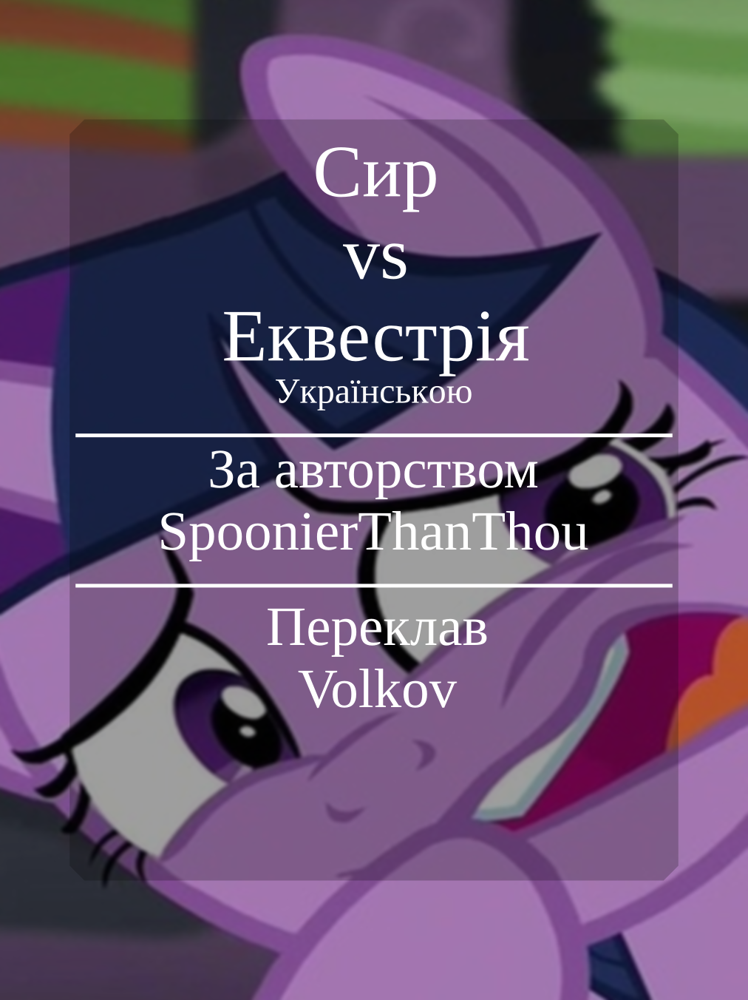

# Сир vs Еквестрія - Українською

Поні із королівської прислуги, побачив банду драконів, яка розбила табір біля Кантерлоту і йому треба про це повідомити Твайлайт. Але є проблема: він не зміг відмовити собі у порції із кількох кесадильй і охорона не пускає його в тронну залу, доки він не позбавиться від них.

# Як відкрити? Де фанфік?
[пдф файл](So%20Cheese%20-%20ukr.pdf)

Ви його можете одразу читати його у гітхабі, або можете завантажити.

Завантажити його можна двома способами:

Перший:

1. Натисніть правою кнопкою миші по посиланню зверху
2. В залежності від того, який браузер ви використовуєте і мову інтерфейсу, знайдіть пункт у контекстному меню типу: "Зберегти посилання як..." або "Save link as..."
3. Оберіть де зберегти файл і збережіть його.
4. Готово, можете відкривати файл у вашому улюбленому переглядачі документів!

Другий:

1. Перейдіть за посиланням зверху.
2. Десь вгорі знайдіть кнопку зі стрілочкою, яка показує вниз і натисніть на неї.
3. Браузер почне завантажувати файл.
4. Як тільки завантаження завершиться, можете відкривати файл у вашому улюбленому переглядачі документів!

# Контакти:
Якщо помітили очепятку, погано перекладений шмат тексту, є якісь побажання?
Тоді ви можете написати мені тут: [Contacts](https://github.com/Vovkiv/mlp_fics_that_i_plan_to_translate/tree/main#contacts)

# Original fic:
[https://www.fimfiction.net/story/538132/so-cheesy](https://www.fimfiction.net/story/538132/so-cheesy)

# Original cover:
[https://cdn-img.fimfiction.net/story/amhh-1687878733-538132-full](https://cdn-img.fimfiction.net/story/amhh-1687878733-538132-full)

# Слідкувати за процесом перекладу і іншими фанфіками, які я вже переклав можна тут:
[https://github.com/Vovkiv/mlp_fics_that_i_plan_to_translate](https://github.com/Vovkiv/mlp_fics_that_i_plan_to_translate)

# Гітхаб теги:
translation fanfiction mlp ukrainian volkov
